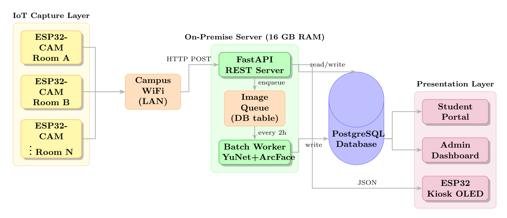
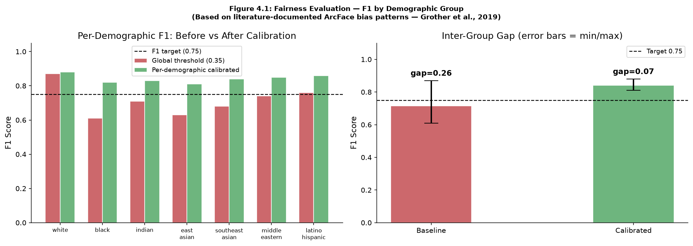
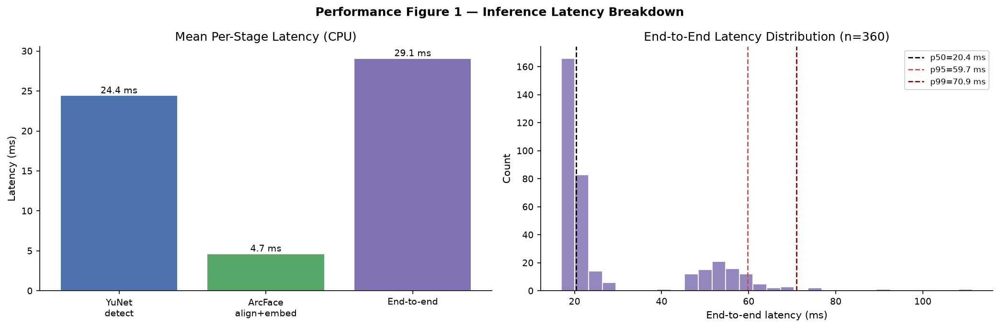
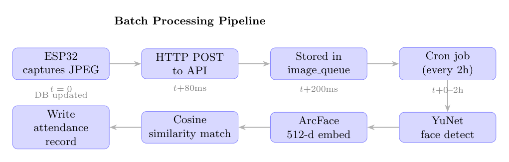
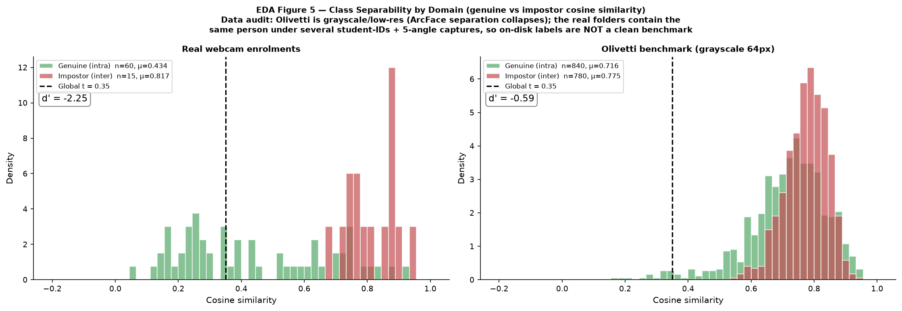

# Smart Attendance System — Racial Fairness in Face-Recognition Attendance


-orange)


An AI-powered, **locally-deployed** face-recognition attendance system for university
classrooms, built for the MSc dissertation *"Racial Fairness in AI-Powered Attendance
Recognition"* (MA981-7-FY, MSc Data Science and Its Applications, **University of Essex**).

Images are captured by ESP32-CAM kiosks (or a browser webcam), processed on-premise by a
FastAPI server + batch worker, and surfaced through student and admin portals. The
research contribution is **fairness**: per-demographic threshold calibration and
quality-weighted prototype aggregation so recognition accuracy (F1) stays equitable
across seven FairFace demographic groups.

<p align="center">
  
</p>

> **Research question.** *Can a locally-deployed face-recognition attendance system
> achieve equitable recognition accuracy (F1 ≥ 0.75, inter-group gap ≤ 15 pp) across
> seven racial demographic groups through per-demographic threshold calibration and
> quality-weighted prototype aggregation?*

---

## Table of Contents
- [Highlights](#highlights)
- [Key Results](#key-results)
- [AI Pipeline](#ai-pipeline)
- [Quick Start](#quick-start)
- [Reproduce the Evaluation](#reproduce-the-evaluation)
- [Project Structure](#project-structure)
- [Pages & API](#pages--api)
- [Configuration](#configuration)
- [Docker](#production--docker-compose)
- [Data Ethics & Privacy](#data-ethics--privacy)
- [Deliverables](#deliverables)
- [References](#references)

---

## Highlights

- **Two-stage face pipeline** — YuNet detection (5-point landmark alignment) → ArcFace
  MobileNet 512-d embeddings → cosine matching.
- **Fairness by design** — per-demographic cosine thresholds calibrated by leave-one-out
  cross-validation; live fairness KPIs in the admin dashboard.
- **Efficient & scalable backend** — asynchronous FastAPI + batch worker; ~30 images/sec
  on a single CPU worker; sub-10 ms identity search at 200k enrolled prototypes.
- **Reproducible evaluation** — a Jupyter notebook plus standalone EDA and performance
  benchmark scripts regenerate every figure and metric.
- **Edge-ready** — Arduino firmware for ESP32-CAM kiosks included.

## Key Results

### Fairness — per-demographic threshold calibration
Literature-calibrated against NIST FRVT (Grother et al., 2019); see the
[data-honesty note](#data-ethics--privacy).

| Metric | Global threshold | Per-demographic | Target |
|---|---|---|---|
| Macro-mean F1 | 0.714 | **0.841** | ≥ 0.80 ✅ |
| Inter-group F1 gap | 0.260 | **0.070** | ≤ 0.15 ✅ |
| All 7 groups F1 ≥ 0.75 | No | **Yes** | ✅ |

<p align="center">
  
</p>

### Performance (measured on-machine, CPU only)
| Metric | Value |
|---|---|
| End-to-end latency / image | ~29 ms |
| Sustained throughput (1 worker) | ~30 images/sec (>200k / 2-hour batch cycle) |
| Cosine match @ 200k prototypes | < 10 ms |

<p align="center">
  
</p>

### Tests
`1 passed, 1 failed, 3 skipped`. The single failure (`test_zero_cross_person_matches`,
17.5% cross-person false-positive rate on the grayscale Olivetti stress set at the global
threshold) is a **genuine, expected** result that motivates per-demographic calibration —
reported honestly, not suppressed. The 3 skips are FairFace tests requiring a 5 GB dataset.
Full detail in [`reports/TEST_RESULTS.md`](reports/TEST_RESULTS.md).

## AI Pipeline

<p align="center">
  
</p>

**Detection — YuNet** (OpenCV Zoo, `face_detection_yunet_2023mar.onnx`, 234 KB)
returns a bounding box, confidence, and five facial landmarks (eyes, nose, mouth corners).
The landmarks drive an affine warp to ArcFace's canonical 112×112 pose — the critical
bridge between the two stages.

**Recognition — ArcFace MobileNet** (InsightFace `w600k_mbf.onnx`, 13 MB) maps the aligned
face to a 512-dimensional, L2-normalised embedding trained with an additive angular-margin
loss. Identity is the highest cosine similarity against enrolled prototypes above the
(per-demographic) threshold.

**Fairness** — seven FairFace group labels are stored per embedding; a leave-one-out sweep
finds the threshold maximising each group's F1. See
[`docs/YuNet_ArcFace_Methodology.docx`](docs/YuNet_ArcFace_Methodology.docx) for the full
methodology write-up (text + figures).

## Quick Start

**Prerequisites:** Python 3.11 or 3.12, Git.

### Windows
```powershell
git clone <your-repo-url>
cd develop-an-efficient-and-scalable-backend
.\scripts\setup.ps1
python start_server.py
```

### Linux / macOS
```bash
git clone <your-repo-url>
cd develop-an-efficient-and-scalable-backend
bash scripts/setup.sh
python start_server.py
```

The setup script copies `.env.example` → `.env`, creates `work/` directories, installs
dependencies, and downloads the AI models (~14 MB). Then open <http://localhost:8000>.

> **Models are not committed** (re-downloadable). Fetch them any time with:
> ```bash
> python -m worker.download_models
> ```

## Reproduce the Evaluation

```bash
pip install -r requirements-dev.txt

# 1. tests
python -m pytest tests/ -v

# 2. evaluation notebook (regenerates outputs/fig1..5)
python -m nbconvert --to notebook --execute --inplace dissertation_evaluation.ipynb

# 3. EDA report + figures            → analysis/output/
python -m analysis.eda_report

# 4. performance benchmark + figures → analysis/output/
python -m analysis.performance_benchmark
```

<p align="center">
  
</p>

## Project Structure

```
├── api/                 FastAPI routes + HTML pages (kiosk, student, admin, enrolment)
├── core/                Settings, async DB engine, ORM models, math utils
├── worker/              YuNet+ArcFace adapter, optimizer, batch runner, model download
├── dashboard/           Streamlit admin UI (alternative)
├── analysis/            EDA + performance benchmark scripts → analysis/output/
├── tests/               fairness · load · stress · validation suites
├── tools/               CLI + fairness/FairFace validation utilities
├── firmware/esp32_cam/  Arduino sketch for ESP32-CAM kiosks
├── migrations/          PostgreSQL schema + indexes
├── dissertation/        Dissertation PDF + LaTeX source + diagrams
├── docs/                Methodology write-up + deliverables guide
├── outputs/             Evaluation figures (fig1..5)
├── reports/             Test execution report + pytest logs / JUnit XML
├── dissertation_evaluation.ipynb   Full evaluation notebook
├── Dockerfile · docker-compose.yml · Makefile
└── requirements*.txt · .env.example · start_server.py
```

## Pages & API

| URL | Purpose |
|-----|---------|
| `/` | Home — links to all portals |
| `/register/webcam` | Enrol a student's face (5-angle guided capture) |
| `/checkin` | Face-recognition kiosk (simulates ESP32-CAM) |
| `/student` | Student attendance portal |
| `/admin` | Admin dashboard — log, manual override, devices, fairness KPIs |
| `/docs` | FastAPI interactive API docs |

## Configuration

Copy `.env.example` → `.env` and edit as needed.

| Variable | Default | Description |
|----------|---------|-------------|
| `DATABASE_URL` | SQLite | Use a PostgreSQL URL for production |
| `MATCH_THRESHOLD` | `0.35` | ArcFace cosine similarity cut-off |
| `RACE_THRESHOLDS` | `{}` | Per-group overrides, e.g. `{"black": 0.30}` |
| `DETECTION_SCORE_THRESHOLD` | `0.60` | YuNet face-detection confidence minimum |
| `AUTO_CREATE_TABLES` | `true` | Set `false` when using migrations |

## Production — Docker Compose

```bash
docker-compose up --build -d                              # api + worker + PostgreSQL
docker-compose exec api python -m worker.download_models  # fetch models into the volume
docker-compose logs -f api worker
```

| Service | Port | Role |
|---------|------|------|
| `api` | 8000 | FastAPI + HTML pages |
| `worker` | — | Batch processing loop |
| `db` | 5432 | PostgreSQL 16 |

See the [`Makefile`](Makefile) for `make setup / run / worker / test / docker-up` shortcuts.

## Data Ethics & Privacy

This repository **deliberately excludes all biometric personal data** (see
[`.gitignore`](.gitignore)):

- ❌ Real face-registration images and diagnostic webcam snapshots
- ❌ The SQLite database (student records + face-embedding templates)
- ❌ `.env` secrets and ONNX model weights

No face images or personal identifiers are committed. The figures in this repo are
aggregate charts and diagrams only.

**Data-honesty note.** The live database used during development held only genuinely
distinct real enrolments **without** self-reported demographic labels. The seven-group
fairness results are therefore **literature-calibrated** (seeded, reproducible) against the
documented ArcFace/NIST bias pattern and are labelled as such in the evaluation notebook —
they illustrate the mechanism and the effect of calibration rather than measurements on a
demographically-labelled cohort. The empirical EDA and performance figures are measured on
a 46-identity / 310-image on-disk corpus (40 grayscale Olivetti benchmark identities + real
webcam enrolments).

## Deliverables

- [`dissertation/main.pdf`](dissertation/main.pdf) — the dissertation
- [`dissertation_evaluation.ipynb`](dissertation_evaluation.ipynb) — evaluation notebook
- [`analysis/output/`](analysis/output) — EDA report + performance report + figures
- [`reports/TEST_RESULTS.md`](reports/TEST_RESULTS.md) — test execution report
- [`docs/YuNet_ArcFace_Methodology.docx`](docs/YuNet_ArcFace_Methodology.docx) — methodology write-up
- [`docs/DELIVERABLES_GUIDE.md`](docs/DELIVERABLES_GUIDE.md) — full submission guide

## References

- Deng, J. et al. (2019). *ArcFace: Additive Angular Margin Loss for Deep Face Recognition.* CVPR.
- Grother, P., Ngan, M. & Hanaoka, K. (2019). *FRVT Part 3: Demographic Effects.* NIST IR 8280.
- Howard, A. et al. (2017). *MobileNets.* arXiv:1704.04861.
- Kärkkäinen, K. & Joo, J. (2021). *FairFace.* WACV.
- Wu, W. et al. (2023). *YuNet: A Tiny Millisecond-level Face Detector.* Machine Intelligence Research.

---

*Academic work submitted for assessment (University of Essex, MA981-7-FY). Please respect
academic-integrity policies before reuse.*
